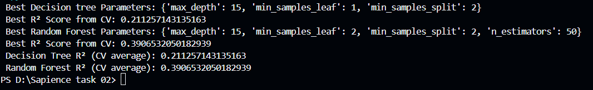
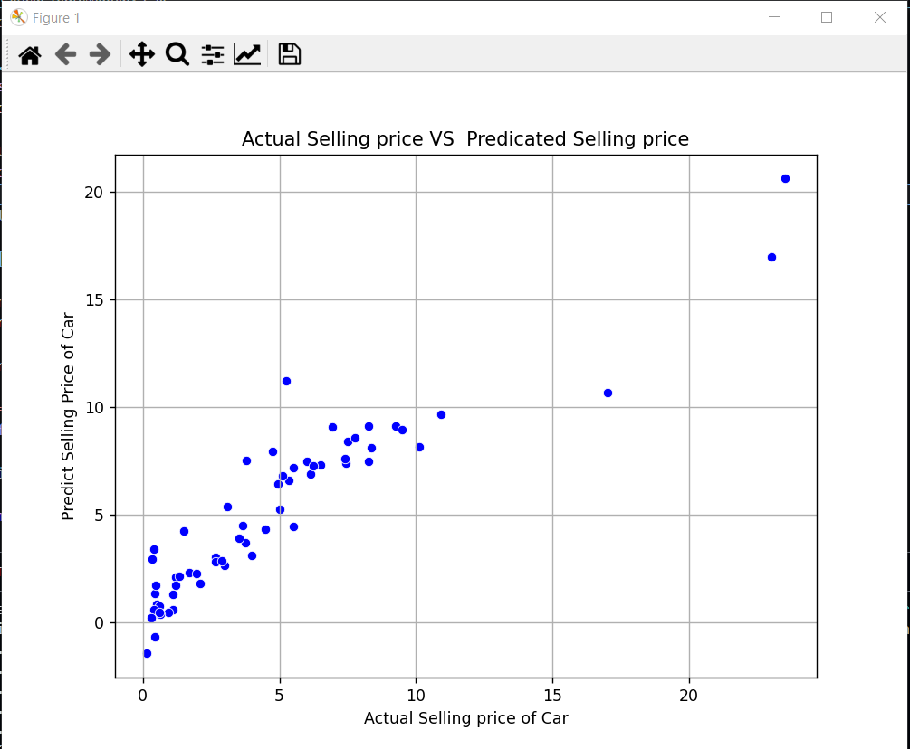
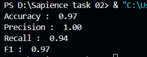
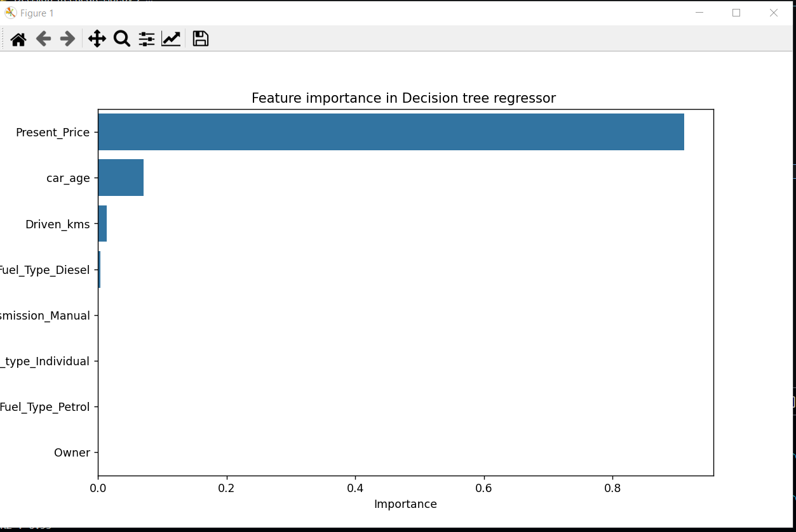
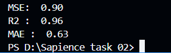

# 🚗 Car Price Prediction and Classification - Internship Task (Week 02)

This project is submitted as part of the **Week 02 Internship Task** at **Sapience EDU Connect Pvt. Ltd.**

It demonstrates the complete end-to-end process of building and evaluating machine learning models to:
- Predict used car prices (regression)
- Classify cars as **High Price** or **Low Price** (classification)

---

## 📁 Project Structure

Car_Price_Prediction/
├── Linear-regression.py
├── Logistic-regression-High-Price.py
├── Decision-treeRegressor.py
├── Random-forestRegressor.py
├── Cross-validation-and-tuning.py
├── Car_Price_ML_Project.docx
├── dataset.csv


---

## 📌 Internship Details

- **Organization**: Sapience EDU Connect Pvt. Ltd.
- **Duration**: June–July 2025
- **Week**: 02
- **Task Theme**: Applied Supervised Machine Learning (Regression + Classification)

---

## 🔍 Project Goals

- Predict selling price of cars using regression models
- Classify cars as **High Price / Low Price** using logistic regression
- Train Decision Trees and Random Forests
- Apply **cross-validation**, **hyperparameter tuning**, and **model evaluation**
- Visualize model performance and feature importance

---

## 🧠 Machine Learning Models Used

| Task                | Models Used                            |
|---------------------|-----------------------------------------|
| Regression          | Linear Regression, Decision Tree Regressor, Random Forest Regressor |
| Classification      | Logistic Regression, Decision Tree Classifier, Random Forest Classifier |
| Optimization        | GridSearchCV + k-Fold Cross Validation |

---

## 📈 Metrics Evaluated

### Regression:
- R² Score
- MAE (Mean Absolute Error)
- MSE (Mean Squared Error)

### Classification:
- Accuracy
- Precision
- Recall
- F1-Score

---

## 📊 Screenshots

### 🔷 Model Evaluation Summary Table  
📌 

### 🔷 Linear Regression Visualization  
📌 

📌 

### 🔷 Logistic Regression Visualization  
📌 


### 🔷 Decision Tree Visualization  
📌 

### 🔷 Decision Tree (Feature Importance)  
📌 

📌 


### 🔷 Random Forest Visualization  
📌 


### 🔷 Feature Importance (Random Forest)  
📌 


---

## 🧾 Documentation

Full report is available in the file:

📄 `Car_Price_ML_Project.docx`

It contains:
- Objective
- Data preprocessing
- Model details
- Evaluation metrics
- Graph/chart placeholders
- Future improvement suggestions

---

## 👨‍💻 Author

**Muhammad Yasir**  
`BSCS Student | ML & AI Enthusiast | Intern @ Sapience EDU Connect Pvt. Ltd.`  
📍 Pakistan  
📫 [yaisikhan111@gmail.com]

---

## 📢 Note

This task was completed independently as part of a learning internship and showcases a full ML pipeline implementation using Python and Scikit-Learn.

---

## 📌 How to Run

1. Clone the repository or download the folder.
2. Make sure Python 3.11+ and required libraries are installed:
   ```bash
   pip install pandas scikit-learn matplotlib seaborn
